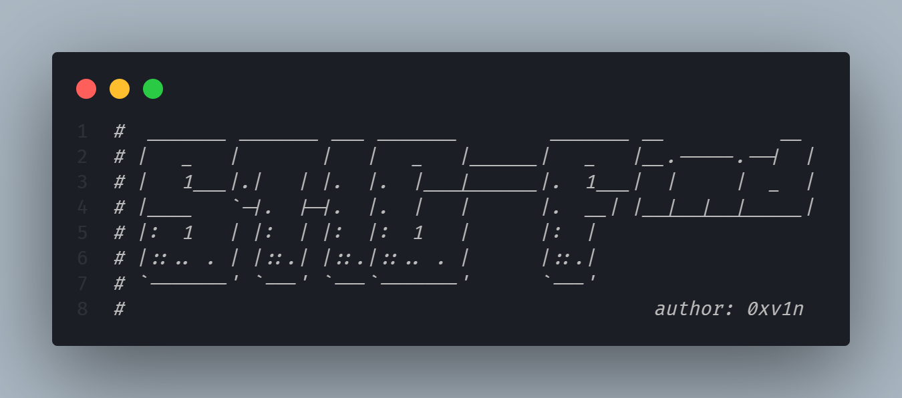

# What is STIG-Find?

This project exists to bring STIG compliance auditing to the hands of anyone. This project is built upon the [Pester](https://pester.dev/) test framework, and allows unit-test style auditing of the [DISA STIGs](https://public.cyber.mil/stigs/) for Windows 10 Enterprise images.

# Prerequisites

You must have the [Pester](https://github.com/pester/Pester) framework installed. A simple command via Administrator console can be executed: `Install-Module -Name Pester -Force`

## Usage

To utilize this script simply run `Invoke-Pester stigfind.ps1`

# Reporting Bugs/Issues

Please open an issue in the GitHub repo (or fix it yourself and open a PR).